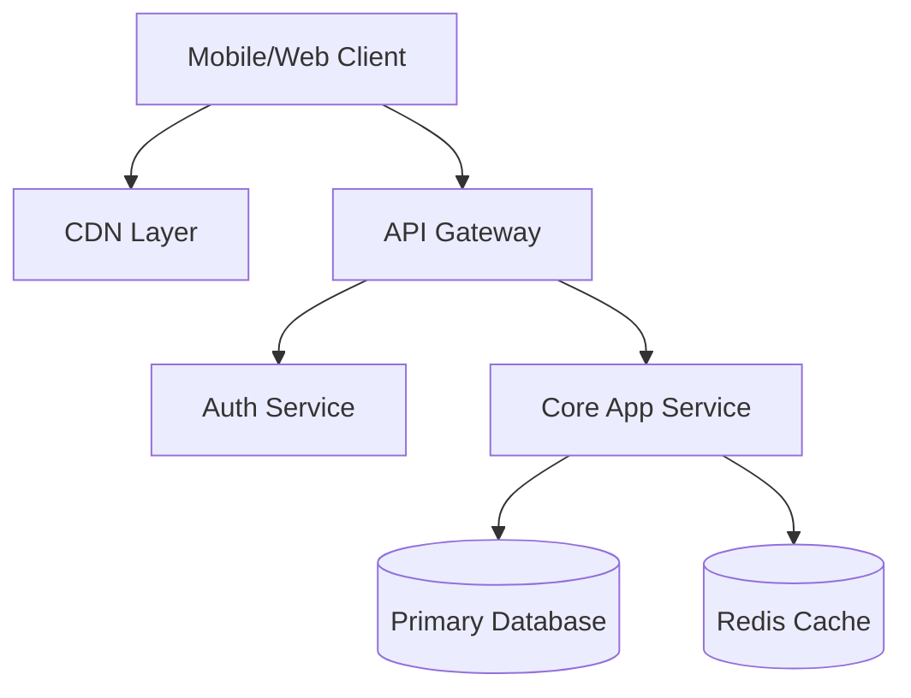
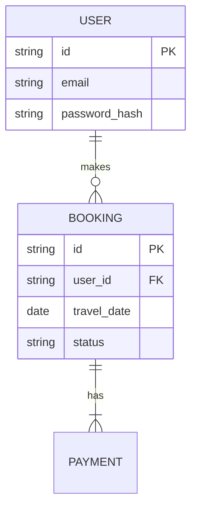

# Travel App POC - Product Specification

> **Version:** 1.0
> **Date:** 2026-01-31
> **Status:** DRAFT

## 1. Executive Summary
*Briefly describe the vision of the Travel App. What problem does it solve? Who are the users?*
[TODO: Solution Engineer to fill this after integration]

---

## 2. System Architecture
### 2.1 High-Level Architecture
*Mermaid diagram showing the relationship between Client, Gateway, Services, and Database.*

### 2.2 Technology Stack
| Layer | Technology | Justification |
| :--- | :--- | :--- |
| **Frontend** | React / Next.js | SEO, Component Reusability |
| **Backend** | Node.js / Go | High concurrency, fast prototyping |
| **Database** | PostgreSQL | Relational data integrity for bookings |
| **Infrastructure** | Docker / AWS | Containerization and scalability |

---

## 3. Functional Requirements

### 3.1 Frontend Specification (User Interface)
*[Assigned to: Frontend Developer]*
*Describe the key pages and user flows.*

#### Key Components:
- **Search Module:** Date picker, Destination autocomplete.
- **Booking Flow:** 3-step wizard (Select -> Details -> Payment).
- **User Dashboard:** Trip history, Profile management.

### 3.2 Backend Specification (API & Data)
*[Assigned to: Backend Developer]*

#### Core API Endpoints:
| Method | Endpoint | Description | Auth Required? |
| :--- | :--- | :--- | :--- |
| `GET` | `/api/v1/flights` | Search flights with query params | No |
| `POST` | `/api/v1/bookings` | Create a new booking | Yes |
| `GET` | `/api/v1/user/trips` | Get current user's history | Yes |

#### Database Schema (ERD):

---

## 4. Non-Functional Requirements (Critical)

### 4.1 Security Best Practices
*[Assigned to: Fullstack Developer / Security Lead]*
*Strategies to ensure data protection and compliance.*

1.  **Authentication:** Implement OAuth2.0 / JWT usage with short-lived tokens.
2.  **Input Validation:** Sanitize all inputs to prevent SQL Injection & XSS.
3.  **Data Protection:** TLS 1.3 for data in transit; AES-256 for PII at rest.
4.  **Rate Limiting:** Implement API rate limiting to prevent DDoS.

### 4.2 Performance Optimization
*[Assigned to: Fullstack Developer / Performance Lead]*

1.  **Caching Strategy:**
    - Browser caching for static assets.
    - Redis caching for frequent search queries (e.g., "Flights from NYC to LON").
2.  **Database Indexing:** Index `travel_date`, `origin`, and `destination` columns.
3.  **Lazy Loading:** Implement lazy loading for images and code-splitting for JS bundles.

---

## 5. Quality Assurance Strategy
*[Assigned to: Tester]*

### 5.1 Testing Levels
- **Unit Tests:** Jest/Mocha for individual functions (Target: 80% coverage).
- **Integration Tests:** API endpoint testing using Postman/Supertest.
- **E2E Tests:** Cypress/Playwright for critical booking flows.

### 5.2 Acceptance Criteria (Example)
**Feature:** Flight Search
- **GIVEN** a user is on the homepage
- **WHEN** they enter a valid origin and destination
- **THEN** a list of available flights should be displayed within 2 seconds.

---

## 6. Project Roadmap
*Phased approach for the POC.*
1.  **Phase 1 (Week 1):** Core API setup & DB Design.
2.  **Phase 2 (Week 2):** Basic Frontend Search & Results UI.
3.  **Phase 3 (Week 3):** Booking Flow & Payments integration.
4.  **Phase 4 (Week 4):** Testing, Bug fixes, and Security Audit.
