# Itinerary Module — ER Diagram

> Auto-generated from [schema.prisma](file:///c:/Users/YSQUARE/OneDrive/sugan/breaking%20code/backend/prisma/schema.prisma)
> Audit fields (`created_at`, `updated_at`, `created_by`, `updated_by`, `deleted_at`, `deleted_by`) excluded for clarity.

```mermaid
erDiagram
    %% =============================================
    %% CORE ITINERARY DOMAIN
    %% =============================================

    itineraries ||--o{ itinerary_days : "has many"
    itineraries ||--o{ itinerary_locations : "has many"
    itineraries ||--o{ smart_imports : "has many"
    itineraries ||--|| discussions : "has one"

    %% =============================================
    %% LOCATIONS (via join table)
    %% =============================================

    locations ||--o{ itinerary_locations : "used in"

    %% =============================================
    %% DAYS → EVENTS
    %% =============================================

    itinerary_days ||--o{ itinerary_events : "has many"

    %% =============================================
    %% EVENT TYPE DETAILS (1-1 TPT)
    %% =============================================

    itinerary_events ||--|| activity_events : "detail"
    itinerary_events ||--|| lodging_events : "detail"
    itinerary_events ||--|| flight_events : "detail"
    itinerary_events ||--|| transport_events : "detail"
    itinerary_events ||--|| cruise_events : "detail"
    itinerary_events ||--|| tour_events : "detail"
    itinerary_events ||--|| booking_events : "detail"
    itinerary_events ||--|| info_events : "detail"

    %% =============================================
    %% COLLABORATION
    %% =============================================

    discussions ||--o{ discussion_messages : "has many"

    %% =============================================
    %% ENTITY DEFINITIONS
    %% =============================================

    itineraries {
        BIGINT itinerary_id PK
        UUID itinerary_key UK
        VARCHAR title
        TEXT description
        ENUM status
        VARCHAR cover_photo_url
        VARCHAR cover_text_overlay
    }

    itinerary_days {
        BIGINT itinerary_day_id PK
        UUID itinerary_day_key UK
        BIGINT itinerary_id FK
        INT day_number
        VARCHAR title
        TEXT description
        TIMESTAMPTZ start_time
        TIMESTAMPTZ end_time
        VARCHAR location_text
    }

    locations {
        BIGINT location_id PK
        UUID location_key UK
        VARCHAR name
        VARCHAR image_url
    }

    itinerary_locations {
        BIGINT itinerary_location_id PK
        UUID itinerary_location_key UK
        BIGINT itinerary_id FK
        BIGINT location_id FK
        INT sort_order
    }

    itinerary_events {
        BIGINT itinerary_event_id PK
        UUID itinerary_event_key UK
        BIGINT itinerary_day_id FK
        ENUM event_type
        VARCHAR title
        TEXT notes
        INT sort_order
        TIMESTAMPTZ start_time
        TIMESTAMPTZ end_time
        DECIMAL price
    }

    activity_events {
        BIGINT activity_event_id PK
        UUID activity_event_key UK
        BIGINT itinerary_event_id FK
        VARCHAR category
        VARCHAR sub_category
        VARCHAR booked_through
        VARCHAR confirmation_number
        VARCHAR provider
    }

    lodging_events {
        BIGINT lodging_event_id PK
        UUID lodging_event_key UK
        BIGINT itinerary_event_id FK
        VARCHAR hotel_name
        VARCHAR hotel_location
        VARCHAR map_link
        TIMESTAMPTZ check_in_at
        TIMESTAMPTZ check_out_at
        JSONB facilities
    }

    flight_events {
        BIGINT flight_event_id PK
        UUID flight_event_key UK
        BIGINT itinerary_event_id FK
        VARCHAR airline_code
        VARCHAR flight_number
        TIMESTAMPTZ departure_at
        TIMESTAMPTZ arrival_at
        INT duration_minutes
        VARCHAR departure_terminal
        VARCHAR arrival_terminal
    }

    transport_events {
        BIGINT transport_event_id PK
        UUID transport_event_key UK
        BIGINT itinerary_event_id FK
        VARCHAR transport_type
        VARCHAR sub_category
        VARCHAR carrier
    }

    cruise_events {
        BIGINT cruise_event_id PK
        UUID cruise_event_key UK
        BIGINT itinerary_event_id FK
        VARCHAR cruise_line
        TEXT cabin_details
    }

    tour_events {
        BIGINT tour_event_id PK
        UUID tour_event_key UK
        BIGINT itinerary_event_id FK
        VARCHAR agency_name
        VARCHAR tour_type
    }

    booking_events {
        BIGINT booking_event_id PK
        UUID booking_event_key UK
        BIGINT itinerary_event_id FK
        VARCHAR provider_name
        VARCHAR confirmation_number
    }

    info_events {
        BIGINT info_event_id PK
        UUID info_event_key UK
        BIGINT itinerary_event_id FK
        VARCHAR category
        VARCHAR sub_category
        VARCHAR provider
    }

    attachments {
        BIGINT attachment_id PK
        UUID attachment_key UK
        ENUM entity_type
        BIGINT entity_id
        ENUM category
        VARCHAR file_name
        VARCHAR file_url
        INT file_size_bytes
        VARCHAR mime_type
        VARCHAR description
    }

    smart_imports {
        BIGINT smart_import_id PK
        UUID smart_import_key UK
        BIGINT itinerary_id FK
        ENUM status
        VARCHAR source_file_url
        VARCHAR source_mime_type
        INT events_created
        TEXT error_message
        TIMESTAMPTZ completed_at
    }

    library_items {
        BIGINT library_item_id PK
        UUID library_item_key UK
        ENUM item_type
        VARCHAR name
        TEXT description
        VARCHAR image_url
        JSONB metadata
    }

    discussions {
        BIGINT discussion_id PK
        UUID discussion_key UK
        BIGINT itinerary_id FK
    }

    discussion_messages {
        BIGINT discussion_message_id PK
        UUID discussion_message_key UK
        BIGINT discussion_id FK
        TEXT content
    }
```

---

## Relationship Summary

| Entity A | Relationship | Entity B | Via (FK Column) |
|----------|:------------:|----------|-----------------|
| `itineraries` | 1-M | `itinerary_days` | `itinerary_days.itinerary_id` |
| `itineraries` | 1-M | `itinerary_locations` | `itinerary_locations.itinerary_id` |
| `locations` | 1-M | `itinerary_locations` | `itinerary_locations.location_id` |
| `itineraries` | 1-M | `smart_imports` | `smart_imports.itinerary_id` |
| `itineraries` | 1-1 | `discussions` | `discussions.itinerary_id` (UNIQUE) |
| `itinerary_days` | 1-M | `itinerary_events` | `itinerary_events.itinerary_day_id` |
| `itinerary_events` | 1-1 | `activity_events` | `activity_events.itinerary_event_id` (UNIQUE) |
| `itinerary_events` | 1-1 | `lodging_events` | `lodging_events.itinerary_event_id` (UNIQUE) |
| `itinerary_events` | 1-1 | `flight_events` | `flight_events.itinerary_event_id` (UNIQUE) |
| `itinerary_events` | 1-1 | `transport_events` | `transport_events.itinerary_event_id` (UNIQUE) |
| `itinerary_events` | 1-1 | `cruise_events` | `cruise_events.itinerary_event_id` (UNIQUE) |
| `itinerary_events` | 1-1 | `tour_events` | `tour_events.itinerary_event_id` (UNIQUE) |
| `itinerary_events` | 1-1 | `booking_events` | `booking_events.itinerary_event_id` (UNIQUE) |
| `itinerary_events` | 1-1 | `info_events` | `info_events.itinerary_event_id` (UNIQUE) |
| `discussions` | 1-M | `discussion_messages` | `discussion_messages.discussion_id` |

> **Note:** `attachments` and `library_items` are standalone entities. `attachments` uses a polymorphic pattern (`entity_type` + `entity_id`) — no direct FK line in the diagram because the reference is resolved at the application layer.

---

## Hard Gates

- [x] Every model in `prisma.schema` appears in the diagram (18/18)
- [x] Every `@relation` is represented with correct cardinality (15 relationships)
- [x] Join tables shown as explicit nodes (`itinerary_locations`)
- [x] Audit fields excluded for clarity
- [x] Mermaid block is valid and renders correctly
