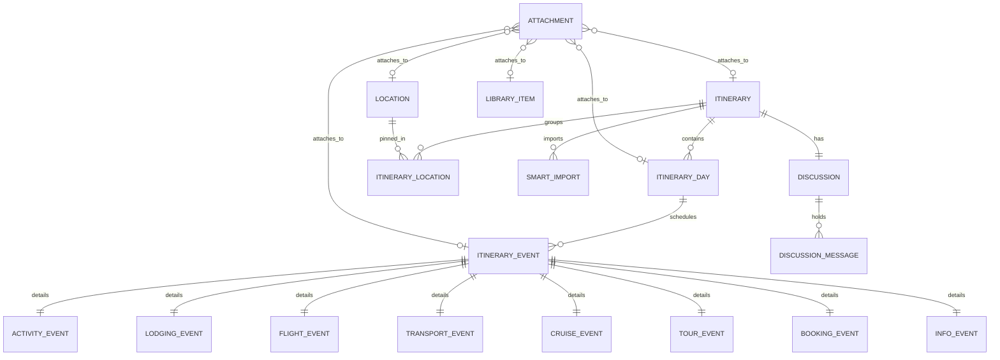

# Itinerary Module — ER Diagram

> Auto-generated from `prisma/schema.prisma` on 2026-02-28

---

---

## Relationship Summary

| Entity A            | Cardinality | Entity B             | FK Column                               | Label       |
|---------------------|-------------|----------------------|-----------------------------------------|-------------|
| ITINERARY           | 1-M         | ITINERARY_DAY        | itinerary_days.itinerary_id             | contains    |
| ITINERARY           | 1-M         | ITINERARY_LOCATION   | itinerary_locations.itinerary_id        | groups      |
| LOCATION            | 1-M         | ITINERARY_LOCATION   | itinerary_locations.location_id         | pinned_in   |
| ITINERARY           | 1-M         | SMART_IMPORT         | smart_imports.itinerary_id              | imports     |
| ITINERARY           | 1-1         | DISCUSSION           | discussions.itinerary_id                | has         |
| ITINERARY_DAY       | 1-M         | ITINERARY_EVENT      | itinerary_events.itinerary_day_id       | schedules   |
| ITINERARY_EVENT     | 1-1         | ACTIVITY_EVENT       | activity_events.itinerary_event_id      | details     |
| ITINERARY_EVENT     | 1-1         | LODGING_EVENT        | lodging_events.itinerary_event_id       | details     |
| ITINERARY_EVENT     | 1-1         | FLIGHT_EVENT         | flight_events.itinerary_event_id        | details     |
| ITINERARY_EVENT     | 1-1         | TRANSPORT_EVENT      | transport_events.itinerary_event_id     | details     |
| ITINERARY_EVENT     | 1-1         | CRUISE_EVENT         | cruise_events.itinerary_event_id        | details     |
| ITINERARY_EVENT     | 1-1         | TOUR_EVENT           | tour_events.itinerary_event_id          | details     |
| ITINERARY_EVENT     | 1-1         | BOOKING_EVENT        | booking_events.itinerary_event_id       | details     |
| ITINERARY_EVENT     | 1-1         | INFO_EVENT           | info_events.itinerary_event_id          | details     |
| DISCUSSION          | 1-M         | DISCUSSION_MESSAGE   | discussion_messages.discussion_id       | holds       |

### Polymorphic Relationships (No DB-level FK)

| Entity A   | Cardinality | Target Entities                                                         | Discriminator Column      | FK Column              |
|------------|-------------|-------------------------------------------------------------------------|---------------------------|------------------------|
| ATTACHMENT | M-1 (poly)  | ITINERARY, ITINERARY_EVENT, ITINERARY_DAY, LOCATION, LIBRARY_ITEM       | attachments.entity_type   | attachments.entity_id  |

### Standalone Entities (No FK Relations)

| Entity       | Notes                                                        |
|--------------|--------------------------------------------------------------|
| LIBRARY_ITEM | Standalone reusable entity; referenced only via ATTACHMENT polymorphic link |

---

## Hard Gates Checklist

- [x] Every model in `prisma.schema` appears in the diagram (18/18)
- [x] Every `@relation` is represented with correct cardinality
- [x] Join tables shown as explicit nodes (`ITINERARY_LOCATION`)
- [x] Audit fields excluded for clarity
- [x] Mermaid block is valid and renders correctly
