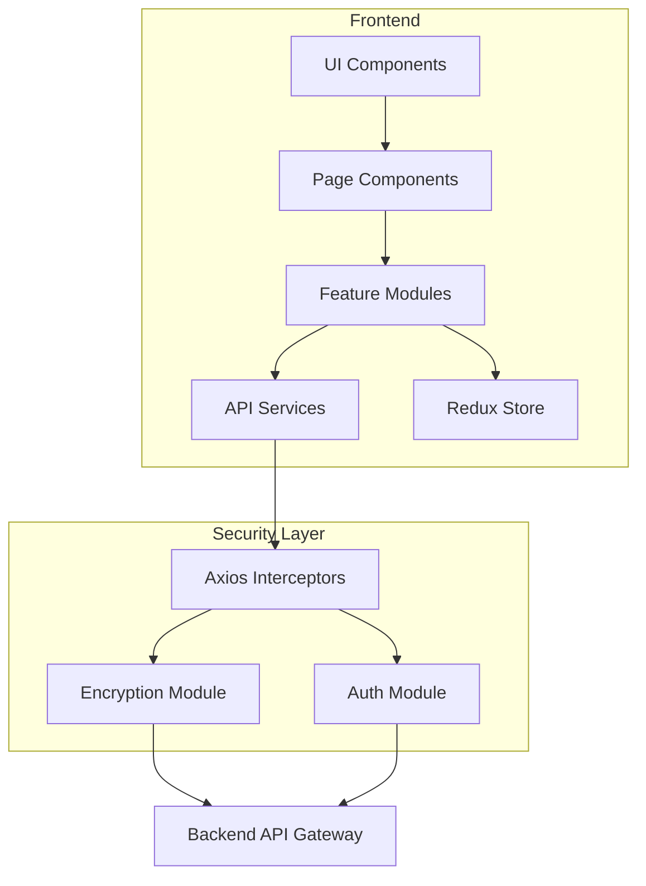
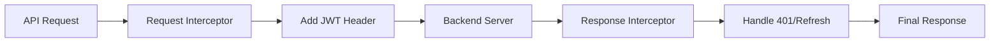

# Tourism Management System - Frontend Technical Specification

> **Version:** 1.0  
> **Date:** 2026-01-31  
> **Status:** APPROVED  
> **Document Type:** Technical Specification

---

## Table of Contents

1. [Executive Summary](#1-executive-summary)
2. [Application Overview](#2-application-overview)
3. [Technology Stack](#3-technology-stack)
4. [System Architecture](#4-system-architecture)
5. [Folder Structure](#5-folder-structure)
6. [Coding Standards & Principles](#6-coding-standards--principles)
7. [State Management](#7-state-management)
8. [API Communication & Authorization](#8-api-communication--authorization)
9. [Security Model](#9-security-model)
10. [Page Specifications](#10-page-specifications)
11. [Component Library](#11-component-library)
12. [Testing Strategy](#12-testing-strategy)
13. [Performance Guidelines](#13-performance-guidelines)
14. [Production Hardening](#14-production-hardening)

---

## 1. Executive Summary

The **Tourism Management System** is an internal operations web application designed for managing tourism-related business operations including leads, bookings, packages, and system settings. This document provides the complete frontend technical specification serving as the **single source of truth** for all frontend development activities.

### Key Objectives
- Provide a robust, secure, and scalable internal operations platform
- Enable efficient lead management and conversion workflows
- Ensure consistent architecture across all frontend modules
- Implement enterprise-grade security measures

---

## 2. Application Overview

| Attribute | Value |
|:----------|:------|
| **Application Type** | Internal Operations Web Application |
| **Platform** | Desktop-only Single Page Application (SPA) |
| **Target Users** | Administrators, Internal Operations Team |

### Core Modules

| Module | Description |
|:-------|:------------|
| **Leads** | Customer enquiry management and tracking |
| **Bookings** | Travel booking management |
| **Packages** | Tourism package configuration |
| **Settings** | System and user configuration |

---

## 3. Technology Stack

| Layer | Technology | Purpose |
|:------|:-----------|:--------|
| **Framework** | Next.js (JavaScript) | Server-side rendering, routing, and React foundation |
| **UI Library** | Material UI (MUI) | Pre-built accessible components and theming |
| **State Management** | Redux Toolkit | Global state management with reduced boilerplate |
| **HTTP Client** | Axios | HTTP requests with interceptor support |
| **Form Validation** | Custom / React Hook Form | Field-level validation and error handling |

---

## 4. System Architecture

### 4.1 High-Level Architecture



### 4.2 Architectural Pattern

- **Feature-based modular architecture**
- Clear separation of concerns:
  - **Layout** - Application shell and navigation
  - **Pages** - Route-level components
  - **Components** - Reusable UI elements
  - **State** - Redux slices and selectors
  - **Services** - API communication layer
  - **Security** - Authentication and encryption utilities

---

## 5. Folder Structure

```
src/
│
├── app/
│   ├── store/                    # Redux store configuration
│   ├── rootReducer.js            # Combined reducers
│   └── authSlice.js              # Authentication state
│
├── layout/
│   ├── Header/                   # Application header
│   ├── Drawer/                   # Side navigation drawer
│   └── AppLayout.jsx             # Main layout wrapper
│
├── features/
│   ├── leads/
│   │   ├── pages/                # Lead-related pages
│   │   │   ├── NewLeadPage.jsx
│   │   │   └── ViewLeadsPage.jsx
│   │   ├── components/           # Lead-specific components
│   │   │   ├── LeadForm.jsx
│   │   │   ├── LeadsTable.jsx
│   │   │   └── LeadFilters.jsx
│   │   ├── services/             # Lead API services
│   │   │   └── leadService.js
│   │   ├── store/                # Lead Redux slice
│   │   │   └── leadsSlice.js
│   │   └── utils/                # Lead utilities
│   │       └── leadValidation.js
│   │
│   ├── bookings/                 # Booking module (structure mirrors leads)
│   ├── packages/                 # Packages module
│   └── settings/                 # Settings module
│
├── shared/
│   ├── components/               # Shared UI components
│   │   ├── DataTable.jsx
│   │   ├── SearchBar.jsx
│   │   ├── DateRangePicker.jsx
│   │   └── ActionMenu.jsx
│   ├── hooks/                    # Custom React hooks
│   │   ├── useDebounce.js
│   │   └── usePagination.js
│   ├── constants/                # Application constants
│   │   └── routes.js
│   └── utils/                    # Shared utilities
│       └── formatters.js
│
├── security/
│   ├── sanitization.js           # Input sanitization
│   └── auth.js                   # Authentication utilities
│
├── services/
│   ├── axiosInstance.js          # Configured Axios instance
│   └── tokenService.js           # Token management
│
└── config/
    ├── env.js                    # Environment configuration
    └── api.js                    # API endpoints configuration
```

---

## 6. Coding Standards & Principles

### 6.1 Core Principles

| Principle | Implementation |
|:----------|:---------------|
| **DRY** | Shared utilities, reusable hooks, common components |
| **KISS** | Simple, predictable UI behavior |
| **SRP** | One responsibility per component |
| **OCP** | Extend functionality via composition and hooks |

### 6.2 Component Guidelines

**UI Components MUST NOT contain:**
- ❌ API logic (use services)
- ❌ Authentication logic (use auth utilities)
- ❌ Encryption logic (handled by interceptors)
- ❌ Direct Redux dispatch (use custom hooks)

**UI Components SHOULD:**
- ✅ Be purely presentational when possible
- ✅ Use props for data and callbacks
- ✅ Implement proper TypeScript/PropTypes
- ✅ Follow MUI theming conventions

### 6.3 Naming Conventions

| Element | Convention | Example |
|:--------|:-----------|:--------|
| Components | PascalCase | `LeadForm.jsx` |
| Hooks | camelCase with `use` prefix | `useDebounce.js` |
| Services | camelCase with `Service` suffix | `leadService.js` |
| Redux Slices | camelCase with `Slice` suffix | `leadsSlice.js` |
| Constants | SCREAMING_SNAKE_CASE | `API_BASE_URL` |

---

## 7. State Management

### 7.1 Redux Usage Rules

**Redux is used ONLY for:**
- ✅ Authentication & session state
- ✅ Shared API data across multiple components
- ✅ Cross-page UI state (e.g., sidebar open/close)

**Redux is NOT used for:**
- ❌ Form state (remains local)
- ❌ Page-specific UI state
- ❌ Temporary modal/dialog state

### 7.2 Auth Slice Structure

```javascript
// authSlice.js
{
  accessToken: string | null,
  refreshToken: string | null,
  tokenExpiry: number | null,
  isAuthenticated: boolean,
  user: {
    id: string,
    email: string,
    role: string
  } | null,
  loading: boolean,
  error: string | null
}
```

### 7.3 Token Security Rules

| Rule | Description |
|:-----|:------------|
| **No Logging** | Tokens must NEVER be logged to console or external services |
| **No Hardcoding** | Tokens must NEVER be hardcoded in source |
| **No Query Params** | Tokens must NEVER be passed via URL query parameters |
| **Secure Storage** | Use httpOnly cookies or secure storage mechanisms |

---

## 8. API Communication & Authorization

### 8.1 Axios Configuration

```javascript
// axiosInstance.js - Core Configuration
const axiosInstance = axios.create({
  baseURL: API_BASE_URL,
  timeout: 30000,
  headers: {
    'Content-Type': 'application/json'
  }
});
```

### 8.2 Interceptor Chain



### 8.3 JWT Authorization Flow

| Step | Action |
|:-----|:-------|
| 1 | User authenticates, JWT received in response headers |
| 2 | Token stored in Redux and secure storage |
| 3 | Axios interceptor attaches token to all requests |
| 4 | Token passed ONLY in `Authorization` header |

### 8.4 Token Refresh Mechanism

```javascript
// Refresh Token Flow
1. Request fails with 401 / token expired
2. Interceptor catches error
3. Refresh token sent to /auth/refresh
4. New access token received
5. Original request retried with new token
6. If refresh fails:
   - Clear auth state
   - Redirect to login (future scope)
```

---

## 9. Security Model

### 9.1 Application-Level Security Measures

| Threat | Mitigation |
|:-------|:-----------|
| **XSS** | React's built-in escaping, CSP headers, input sanitization |
| **SQL Injection** | Input validation, parameterized queries (backend) |
| **CSRF** | Token-based auth, SameSite cookies |
| **Data Exposure** | No sensitive data in logs, errors, or localStorage |

### 9.2 Input Sanitization

All user inputs must be sanitized using the `sanitization.js` utility:

```javascript
import { sanitizeInput, sanitizeHTML } from '@/security/sanitization';

// Text inputs
const cleanInput = sanitizeInput(userInput);

// Rich text (if applicable)
const cleanHTML = sanitizeHTML(userHTML);
```

### 9.3 PII Handling

| Phase | Implementation |
|:------|:---------------|
| **Current** | Secure handling, no masking |
| **Future** | UI-level PII masking for display (optional) |

---

## 10. Page Specifications

### 10.1 New Lead Page

#### Purpose
Allows internal users to create new tourism enquiries and capture customer travel intent.

#### Form Fields

| Field | Type | Required | Validation |
|:------|:-----|:---------|:-----------|
| Name | Text | ✅ | Min 2 characters |
| Mobile Number | Text | ✅ | Valid phone format, 10 digits |
| Email ID | Email | ✅ | Valid email format |
| Travel Date | Date | ✅ | Future date only |
| Duration | Number | ✅ | Positive integer |
| Destination | Autocomplete | ✅ | From predefined list |
| Travel Type | Select | ✅ | Domestic/International |
| No. of Travelers | Number | ✅ | Min 1 |
| Budget | Currency | ❌ | Positive number |
| Lead Source | Select | ✅ | Predefined sources |
| Notes | Textarea | ❌ | Max 500 characters, sanitized |

#### State Management
- Form state remains **local** (React state/useReducer)
- Redux NOT required for form data

#### API Integration

```
POST /leads
- JWT protected
- Normalized request structure
```

#### UX Behavior
- Disable submit button during API call
- Show loading indicator
- Success: Redirect to View Leads page
- Cancel: Return without side effects
- Failure: Show inline error, retain form data

---

### 10.2 View Leads Page

#### Purpose
Enables internal users to view, search, filter, and manage all leads.

#### UI Components

| Component | Description |
|:----------|:------------|
| Search Bar | Filter by Name, Email, or Mobile |
| Date Range Filter | From-To date selection |
| Leads Data Table | Paginated lead listing |
| Pagination Controls | Page navigation |
| Row Action Menu | Per-row actions (3-dot menu) |

#### Data Table Columns

| Column | Sortable | Description |
|:-------|:---------|:------------|
| Lead Name | ✅ | Customer name |
| Contact Info | ❌ | Email + Mobile |
| Destination | ✅ | Travel destination |
| Travel Type | ✅ | Domestic/International |
| Date & Time | ✅ | Lead creation timestamp |
| No. of Travelers | ❌ | Traveler count |
| Actions | ❌ | 3-dot action menu |

#### Row Actions

| Action | Description |
|:-------|:------------|
| View | Open lead details in read-only mode |
| Edit | Open lead in edit mode |
| Convert to Quote | Transform lead to quote |
| Delete | Remove lead (with confirmation) |

#### State Management

**Local State:**
- Search input value
- Date filter values
- Expanded row state
- Action menu anchor

**Redux State:**
- Lead list data
- Pagination metadata (page, limit, total)
- Loading state
- Error state

#### API Integration

```
GET /leads
Query Parameters:
  - page: number
  - limit: number
  - searchText: string (optional)
  - fromDate: ISO date (optional)
  - toDate: ISO date (optional)

- JWT protected
```

#### Performance Optimizations
- Debounced search input (300ms)
- Memoized table rows with React.memo
- Virtualized list for large datasets (future)

---

## 11. Component Library

### 11.1 Shared Components

| Component | Props | Usage |
|:----------|:------|:------|
| `DataTable` | columns, data, onRowClick, loading | Standard data table with sorting |
| `SearchBar` | value, onChange, placeholder, onClear | Debounced search input |
| `DateRangePicker` | from, to, onChange | Date range selection |
| `ActionMenu` | actions, onAction | 3-dot menu with actions |
| `LoadingOverlay` | loading, children | Loading state wrapper |
| `EmptyState` | icon, title, description | No data display |
| `ErrorBoundary` | fallback, children | Error handling wrapper |

### 11.2 Form Components

| Component | Props | Usage |
|:----------|:------|:------|
| `FormTextField` | name, label, required, validation | Standard text input |
| `FormSelect` | name, label, options, required | Dropdown select |
| `FormDatePicker` | name, label, minDate, maxDate | Date selection |
| `FormAutocomplete` | name, label, options, async | Searchable dropdown |

---

## 12. Testing Strategy

### 12.1 Testing Levels

| Level | Tool | Target Coverage |
|:------|:-----|:----------------|
| **Unit Tests** | Jest + React Testing Library | 80% |
| **Integration Tests** | Jest + MSW | API service layer |
| **E2E Tests** | Cypress/Playwright | Critical user flows |

### 12.2 Required Test Coverage

| Module | Requirement |
|:-------|:------------|
| Components | Render tests, interaction tests |
| Redux Slices | Action creators, reducers, selectors |
| Axios Interceptors | Request/response transformation |
| Auth Utilities | Token handling, refresh logic |

### 12.3 Test File Naming

```
ComponentName.jsx       → ComponentName.test.jsx
leadService.js          → leadService.test.js
leadsSlice.js           → leadsSlice.test.js
```

---

## 13. Performance Guidelines

### 13.1 Bundle Optimization

| Strategy | Implementation |
|:---------|:---------------|
| Code Splitting | Dynamic imports for routes |
| Tree Shaking | ES modules, named exports |
| Lazy Loading | React.lazy for heavy components |

### 13.2 Runtime Optimization

| Strategy | Implementation |
|:---------|:---------------|
| Memoization | React.memo, useMemo, useCallback |
| Virtualization | Virtual lists for large datasets |
| Debouncing | Search and filter inputs |
| Caching | SWR/React Query for API responses |

### 13.3 Performance Metrics

| Metric | Target |
|:-------|:-------|
| First Contentful Paint | < 1.5s |
| Time to Interactive | < 3s |
| Largest Contentful Paint | < 2.5s |

---

## 14. Production Hardening

### 14.1 Security Checklist

- [ ] Secure logout implementation
- [ ] Token expiry handling
- [ ] Session invalidation on logout
- [ ] No sensitive data in build artifacts
- [ ] Environment variables for secrets
- [ ] CSP headers configured
- [ ] HTTPS enforced

### 14.2 Error Handling

| Error Type | Handling |
|:-----------|:---------|
| API Errors | Toast notification, retry option |
| Network Errors | Offline indicator, queue requests |
| Auth Errors | Redirect to login, clear state |
| Validation Errors | Inline field errors |

### 14.3 Monitoring (Future)

- Error tracking (Sentry)
- Performance monitoring (Web Vitals)
- User analytics (anonymized)

---

## Appendix A: API Endpoints Reference

| Method | Endpoint | Description | Auth |
|:-------|:---------|:------------|:-----|
| `POST` | `/auth/login` | User authentication | No |
| `POST` | `/auth/refresh` | Token refresh | Yes |
| `POST` | `/auth/logout` | User logout | Yes |
| `GET` | `/leads` | List leads with filters | Yes |
| `POST` | `/leads` | Create new lead | Yes |
| `GET` | `/leads/:id` | Get lead details | Yes |
| `PUT` | `/leads/:id` | Update lead | Yes |
| `DELETE` | `/leads/:id` | Delete lead | Yes |

---

## Appendix B: Environment Variables

```env
# API Configuration
NEXT_PUBLIC_API_BASE_URL=https://api.example.com
NEXT_PUBLIC_API_TIMEOUT=30000

# Feature Flags
NEXT_PUBLIC_ENABLE_PII_MASKING=false
```

---

## Document History

| Version | Date | Author | Changes |
|:--------|:-----|:-------|:--------|
| 1.0 | 2026-01-31 | System | Initial specification |

---

**END OF FRONTEND TECHNICAL SPECIFICATION**
