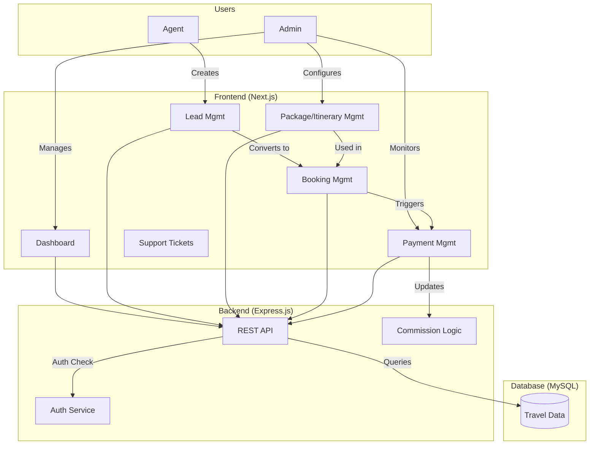

# Product Requirement Document (PRD): Travel Management System

**Version:** 1.0
**Status:** Draft
**Date:** 2026-01-31

---

## 1. Product Overview
The **Travel Management System** is a B2B2C web application designed to streamline the travel business workflow. It serves as a centralized platform for managing leads, creating itineraries and packages, processing bookings and payments, and handling agent commissions. The system aims to replace manual tracking methods with a digital dashboard that provides real-time insights into business performance.

## 2. Business Objective & Success Metrics
### Business Objectives
*   **Centralize Operations:** Consolidate lead, booking, and payment management into a single interface.
*   **Increase Conversion:** Improve lead-to-customer conversion rates through better tracking and follow-ups.
*   **Automate Commissions:** Accurate and transparent calculation of agent commissions.
*   **Visibility:** Provide admins with a high-level view of business health (revenue, active leads, itinerary status).

### Success Metrics (KPIs)
*   **Lead Conversion Rate:** % of leads converted to paid bookings.
*   **Agent Efficiency:** Average time to create an itinerary/booking.
*   **System Adoption:** % of active agents using the platform daily.
*   **Revenue Accuracy:** 0% discrepancy in commission payouts and payment operational records.

## 3. Target Users & User Personas

### 3.1 Admin (Super User)
*   **Role:** Business Owner / Operations Manager.
*   **Goals:** Oversee entire business, manage agents, ensure financial accuracy, and configure system settings (packages, itineraries).
*   **Pain Points:** Lack of visibility into agent activities, manual commission calculations, scattered lead data.

### 3.2 Agent
*   **Role:** One who brings business.
*   **Goals:** Quickly convert leads, create attractive itineraries, track their own earnings/commissions, and support customers.
*   **Pain Points:** Slow itinerary creation, difficulty tracking payment status for their clients, manual follow-ups.

## 4. Core User Journeys

### 4.1 Lead to Booking (Agent Flow)
1.  **Lead Capture:** Agent logs in creating a new "Lead" (manual entry).
2.  **Qualification:** Agent interacts with lead, updates status (e.g., "Interested", "Follow-up").
3.  **Proposal:** Agent selects/creates a Package/Itinerary and sends a Quotation to the lead.
4.  **Booking:** Lead accepts (offline/online), Agent converts "Lead" to "Booking".
5.  **Payment:** Agent records payment or triggers payment link; System updates Booking status to "Confirmed".
6.  **Commission:** System calculates commission for the Agent.

### 4.2 Business Management (Admin Flow)
1.  **Setup:** Admin creates standard Packages and Itinerary templates.
2.  **Agent Onboarding:** Admin adds new Agent accounts and sets commission rates.
3.  **Monitoring:** Admin views Dashboard for "Total Leads", "Converted Leads", "Revenue".
4.  **Payouts:** Admin reviews calculated commissions and marks them as paid.

## 5. Functional Requirements

### 5.1 Dashboard
*   **[MUST]** Admin Dashboard: Show Total Itineraries, Total Leads, Converted Leads count, Payment Status (Pending/Received), Total Commission Due.
*   **[MUST]** Agent Dashboard: Show My Leads, My Bookings, My Earnings, Pending Tasks.

### 5.2 User Management (Agents)
*   **[MUST]** Admin can Create/Update/Deactivate Agents.
*   **[MUST]** Admin can define Commission structure (e.g., flat fee or % per booking).

### 5.3 Leads Management
*   **[MUST]** CRUD operations for Leads (Name, Contact, Source, Status).
*   **[SHOULD]** Lead Status Workflow (New -> Contacted -> Proposal Sent -> Converted / Lost).

### 5.4 Packages & Itinerary Management
*   **[MUST]** Create standard Packages (Destinations, Days/Nights, Inclusions).
*   **[MUST]** Create custom Itineraries for specific leads.
*   **[NICE-TO-HAVE]** PDF Generation for Itineraries to email customers.

### 5.5 Bookings & Payments
*   **[MUST]** Convert Lead/Quotation to Booking.
*   **[MUST]** Record Payments (Amount, Date, Mode, Reference ID).
*   **[MUST]** Track Payment Status (Partial, Full, Overdue).

### 5.6 Support Tickets
*   **[MUST]** Agent can raise support tickets for issues (e.g., Booking failure, Commission dispute).
*   **[MUST]** Admin/Support Staff can view and resolve tickets.

## 6. Non-Functional Requirements
*   **Performance:** Dashboard load time < 2 seconds.
*   **Scalability:** Support up to 100 concurrent agents initially.
*   **Security:**
    *   Secure Password Storage (hashed).
    *   Role-Based Access Control (RBAC) to separate Admin/Agent data.
    *   HTTPS for all data in transit.
*   **Reliability:** 99.9% Uptime during business hours.

## 7. Key Assumptions & Constraints
### Assumptions
*   **Email Service:** Using AWS SES for notifications (Welcome emails, Booking confirmations).
*   **Payment Gateway:** Payment collection might be offline initially (recorded manually) or via a standard gateway (Stripe/Razorpay) integrated later. We assume **Manual Recording** for MVP unless specified.
*   **Commissions:** Calculated immediately upon Booking Confirmation/Full Payment.

### Constraints
*   **Tech Stack:**
    *   **Frontend:** Next.js (React)
    *   **Backend:** Express.js (Node.js)
    *   **Database:** MySQL
    *   **Infrastructure:** AWS (S3 for file storage, EC2 for hosting / Amplify for simple deployment).
*   **Phase:** MVP (Minimum Viable Product).

## 8. Out-of-Scope (for MVP)
*   **Customer Portal:** Direct login for end-customers to view bookings (Agents act as intermediaries).
*   **Dynamic Pricing:** Automated flight/hotel API integrations (Manual package pricing for now).
*   **Mobile App:** Web-only initially.

## 9. Open Questions & Risks
*   **Risk:** Manual payment recording impacts data accuracy. *Mitigation: Implement payment gateway integration in Phase 1.5.*
*   **Question:** Should Agents see other Agents' performance? *Assumption: No, strict data isolation.*

## 10. Dependencies
*   AWS Account Setup (S3 buckets, EC2 instances/Amplify).
*   Database Schema Design (MySQL).
*   UI/UX Design System.

---

## 11. Tech Stack Analysis (Missing Components)
Based on the provided constraints, the following components are recommended to complete the stack:

1.  **ORM (Object-Relational Mapping):** **Prisma** or **Sequelize**. (To interact with MySQL efficiently from Express/Next.js).
2.  **Authentication:** **NextAuth.js** or **AWS Cognito**. (For secure Admin/Agent login).
3.  **UI Framework:** **Tailwind CSS** or **Material UI**. (For rapid UI development, as Next.js doesn't provide built-in components).
4.  **State Management:** **React Context** (sufficient for MVP) or **Zustand**.
5.  **Validation:** **Zod** or **Joi** (for API request validation).
6.  **Testing:** **Jest** (Unit) and **Cypress/Playwright** (E2E).

---

## 12. System Flow Diagram (Mermaid)

